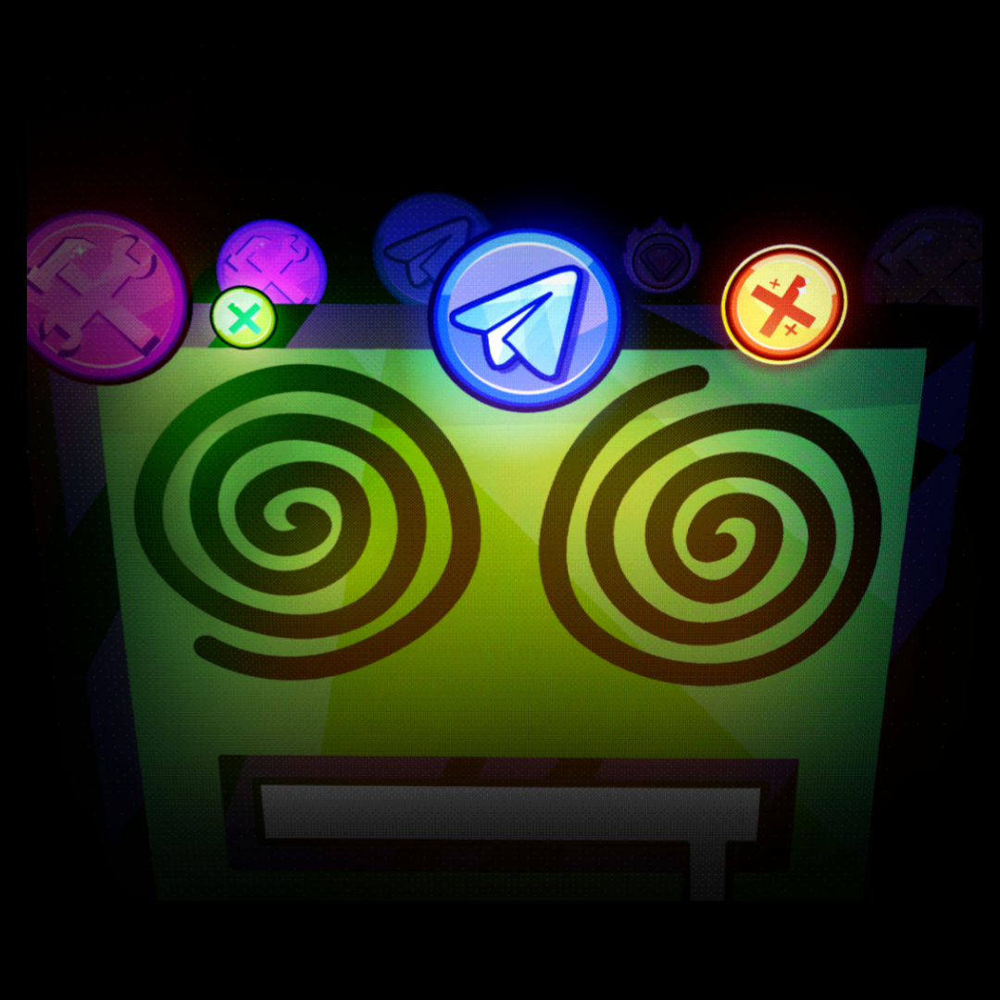

#  RusDash
[🇷🇺 Русская версия](README-RU.md) (Активно) | [🇺🇸 English](README.md)

GDPS проект на основе Geode!

##  Функции
- Автоматическое переключение на сервера RusDash!
- Замена официальных уровней!
- Кастомные бейджики!

## Кредиты
* [lil2kki](https://github.com/lil2kki) - Объяснил некоторое
* [km7dev](https://github.com/Kingminer7) - Server API
* [DasshuDev](https://github.com/DasshuDev/Badgified) - Badgified API
* [CMDxsus](https://t.me/CMDxsus) - Помог с разработкой мода (сделал почти всё хы)

Приятной игры <3